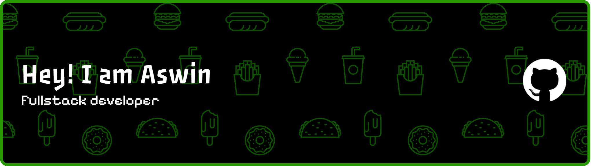

<!-- ===================== HEADER ===================== -->

<p align="center">
  
</p>

<h1 align="center">ASWIN S</h1>

<p align="center">
  <strong>Full Stack Developer</strong>
  <br/>
  Second-Year B.Tech Information Technology Student
</p>

<p align="center">
  <a href="https://github.com/Aswins2025">
    
  </a>
  <a href="https://www.linkedin.com/in/aswin-s-785921380/">
    
  </a>
  <a href="mailto:aswinsrinivasan1007@gmail.com">
    
  </a>
</p>

---

## About Me

I’m a Full Stack Developer and second-year B.Tech Information Technology student passionate about building modern, scalable, and user-focused web applications.

I enjoy transforming ideas into functional digital products while continuously improving my development skills and exploring new technologies.

- Currently developing full-stack web applications
- Interested in frontend and backend development
- Focused on writing clean and maintainable code
- Continuously learning modern development technologies
- Interested in building practical and real-world projects

---

## Tech Stack

### Programming Languages

<p>
  
  
</p>

### Frontend Development

<p>
  
  
  
  
</p>

### Backend Development

<p>
  
</p>

### Database

<p>
  
</p>

### Development Tools

<p>
  
  
</p>

---

## Featured Projects

### Portfolio

A personal developer portfolio designed to showcase my skills, projects, technologies, and development journey.

**Focus:** Frontend Development, Responsive Design, User Experience

---

### Automated Security Assessment Platform

A web-based security assessment platform designed to analyze applications and identify potential security vulnerabilities.

**Focus:** Application Security, Vulnerability Assessment, Security Reporting

---

## Currently Learning

<p>
  
  
</p>

I am currently strengthening my knowledge in modern frontend development with React and database development using MongoDB.

---

## Development Focus

```text
Frontend Development
        |
        v
HTML → CSS → JavaScript → React
        |
        v
Backend Development
        |
        v
Node.js
        |
        v
Database
        |
        v
MongoDB
        |
        v
Full Stack Applications
